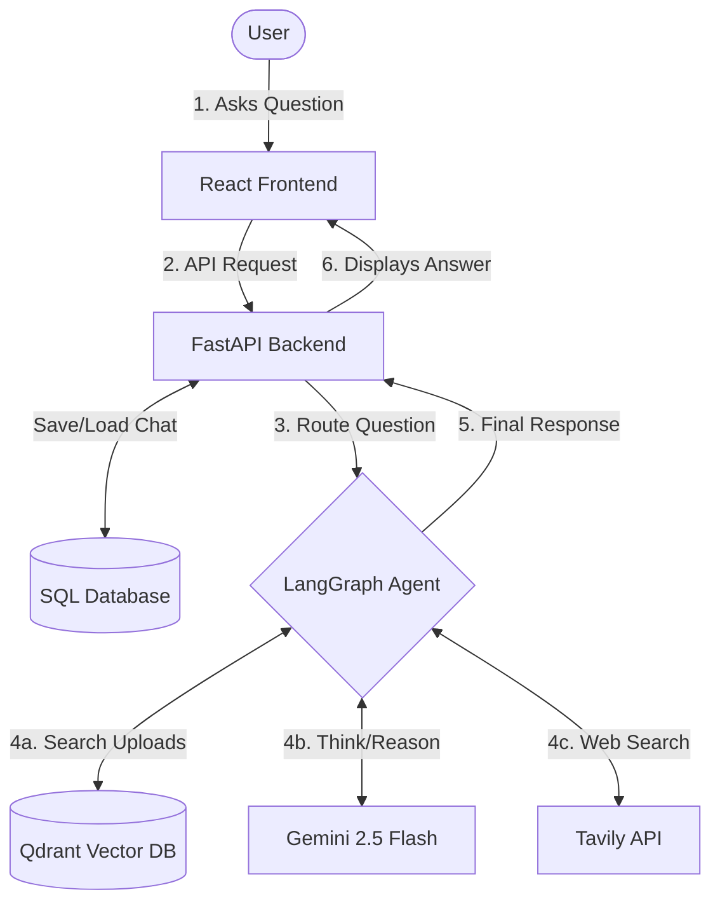

# ChatGPT Clone (with RAG & Web Search)

A full-stack ChatGPT clone featuring document upload (RAG) and real-time web searching. Built with modern web technologies and advanced AI agent architectures.

## 🚀 Features

- **ChatGPT-like UI:** Beautiful, responsive React interface resembling the original ChatGPT.
- **Chat Sessions:** Create, switch between, and permanently delete chat sessions.
- **Persistent Memory:** Conversations are saved in a SQL database.
- **RAG (Retrieval-Augmented Generation):** Upload documents and ask questions about them. The app uses Qdrant vector database to retrieve relevant context.
- **Web Search Agent:** If the answer isn't in your uploaded documents, the AI automatically uses the **Tavily Search API** to fetch real-time answers from the web.
- **Agentic Workflow:** Powered by **LangGraph** (`create_react_agent`) to intelligently route between using document context and executing web search tools.

## 🛠️ Tech Stack

**Frontend:**
- React (TypeScript)
- Vite
- Lucide Icons
- Vanilla CSS

**Backend:**
- FastAPI (Python)
- SQLAlchemy (Database ORM)
- LangChain & LangGraph (AI Orchestration)
- Google Gemini 2.5 Flash (LLM)
- Tavily (Web Search API)
- Qdrant (Vector Database for RAG)

## 📦 Installation & Setup

### Prerequisites
- Node.js & npm
- Python 3.10+
- API Keys for Google Gemini and Tavily

### 1. Clone the repository
```bash
git clone <your-repo-url>
cd chatgpt
```

### 2. Backend Setup
Navigate to the root directory and install Python dependencies:
```bash
pip install -r requirements.txt
```

Set up your environment variables. Create a `.env` file in the root directory:
```env
GOOGLE_API_KEY=your_gemini_api_key_here
TAVILY_API_KEY=your_tavily_api_key_here
```

Start the FastAPI server:
```bash
cd backend
uvicorn main:app --reload
```

### 3. Frontend Setup
Open a new terminal and navigate to the frontend directory:
```bash
cd frontend
npm install
npm run dev
```

The frontend will be available at `http://localhost:5173` (or similar, check Vite output) and the backend API runs on `http://127.0.0.1:8000`.

## 🧠 Architecture Flowchart



## 🧠 How the AI Works
When you ask a question:
1. **Document Retrieval:** The system first checks Qdrant to see if you have uploaded any documents relevant to your question.
2. **Evaluation:** The Gemini 2.5 Flash model evaluates the context.
3. **Agent Action (LangGraph):** If the document doesn't contain the answer, the LangGraph agent autonomously decides to execute the **Tavily Web Search Tool** to find real-time information from the internet before formulating its final response.
